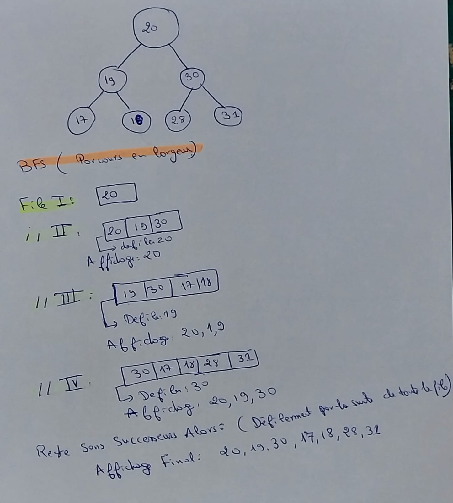

#BFS Algorithm
---
Le parcours en largeur (BFS - Breadth-First Search) est un algorithme utilisé pour explorer ou parcourir une structure de données, généralement un graphe ou un arbre, de manière itérative. L'idée principale derrière le BFS est de commencer à partir d'un nœud source (ou d'une racine dans le cas d'un arbre) et d'explorer tous les voisins de ce nœud avant de passer aux voisins des voisins, et ainsi de suite. Cette approche garantit que tous les nœuds à une distance donnée par rapport à la source sont explorés avant de passer à la distance suivante.
---
Le principe est expliquée  en example detaillé:
