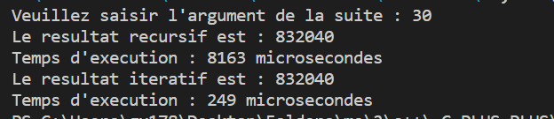

---
                                      Suite De Fibunacci "Fibonacci Sequence"
---

<h4>Principe De Suite De Fibunacci :</h4>

 
La suite de Fibonacci est une séquence infinie d'entiers où chaque terme est la somme des deux termes précédents. La suite commence généralement par les termes 0 et 1. Mathématiquement, elle est définie comme suit :

 f0=0 ;
 f1=1 ;
 fn=fn-1+fn-2 (n>=0) ;

La principale différence entre l'implémentation itérative et récursive pour la suite de Fibonacci réside dans la façon dont les calculs sont effectués.D'ailleurs   ceçi donne 2 temps d'execution différent.

### Approche Récursive :
- **Avantages :**
  - Implémentation concise et proche de la définition mathématique de la suite de Fibonacci.
  - Facile à comprendre.
- **Inconvénients :**
  - Duplication des calculs : Certains termes de la suite sont recalculés plusieurs fois, ce qui peut entraîner une performance médiocre pour de grandes valeurs de `n`.
  - Utilisation importante de la pile : Pour de grandes valeurs de `n`, la récursion peut entraîner un débordement de pile (stack overflow).

### Approche Itérative :
- **Avantages :**
  - Évite la duplication des calculs : Chaque terme est calculé une seule fois, améliorant les performances.
  - Utilisation plus efficace de la mémoire : L'approche itérative n'utilise généralement pas autant de mémoire que la récursion.
- **Inconvénients :**
  - Peut sembler moins élégant pour certains, car elle ne suit pas directement la définition récursive.

En résumé, dans ce cas l'approche itérative est généralement plus efficace en termes de performances pour le calcul de la suite de Fibonacci en raison de l'élimination de la duplication des calculs. Cependant, l'approche récursive peut être préférée pour sa simplicité conceptuelle.

