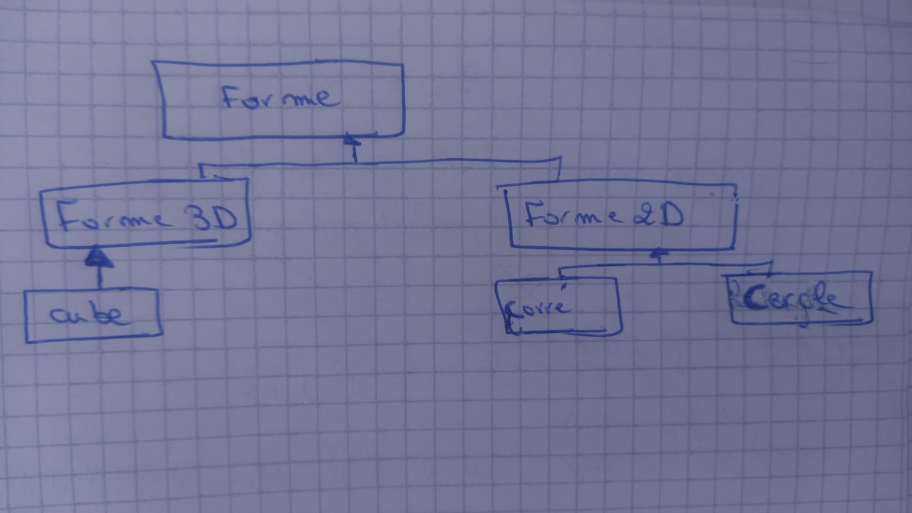

# Classe Précise pour les formes à utilisés si on veut creer application pour dessin des formes mathématiques par exemples
<i>
Appliquer le principe d'herithage d'une classe abstraite par les methodes virtual et override .
</i>

<h3>Schéme Explicatif</h3>
