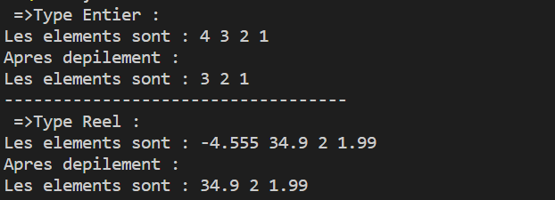

---
                                   Programation Générique du Pile 
---

Dans ce programme , on a utilisé le mot-clé template  pour déclarer une fonction ou une classe générique. Le paramètre <typename T> spécifie le type générique,on peut utilisé T comme un type ordinaire dans le reste de la définition. on peut également utilisé  class à la place de typename .
-**Exemple D'execution:**
