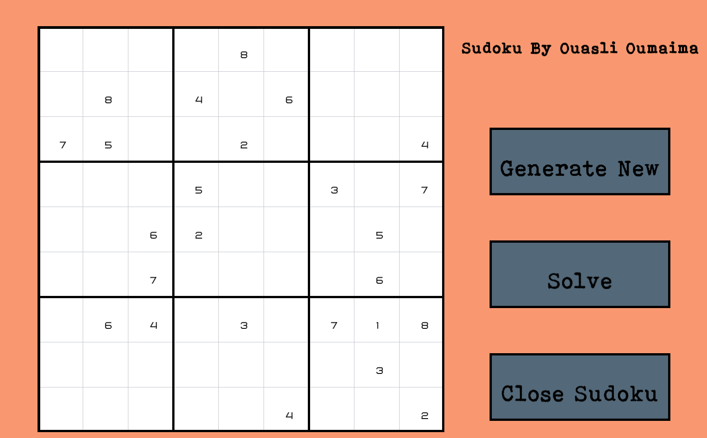
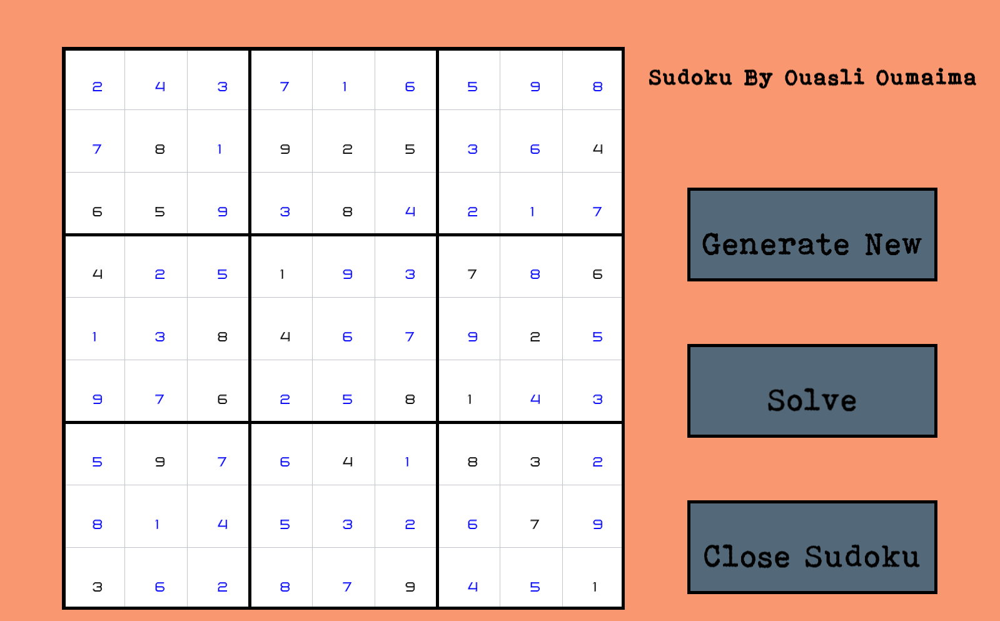

<h2>Sudoku Game Mini Project </h2>

@Author : Ouasli Oumaima

This is a Sudoku solver using a backtracking algorithm provides users with a graphical interface to interact with and solve Sudoku puzzles. 
It efficiently solves puzzles by exploring possible configurations and backtracking when necessary, providing an engaging and interactive experience for users.
There is a generating button for new numbers , and a solve button for solve any sudoku generated.

we've implemented a graphical user interface (GUI) using SFML to display the Sudoku board and allow user interaction.

<h3>Configuration</h3>

```
 - Install SFML
 - Assure you have the right of c++ in your project configuration " add the default one c14 to use the shuffle method" 
 - In your terminal use : g++ -c main.cpp -I<installation-de-sfml>/include
 - g++ main.o -o sfml-app -L<installation-de-sfml>/lib -lsfml-graphics -lsfml-window -lsfml-system
 - For  run your game project :  ./sfml-app "Change by any name"

```
<h3>Previews:</h3>
✅Generate A new Sudoku



✅Generating a Sudoku example and Solve it


